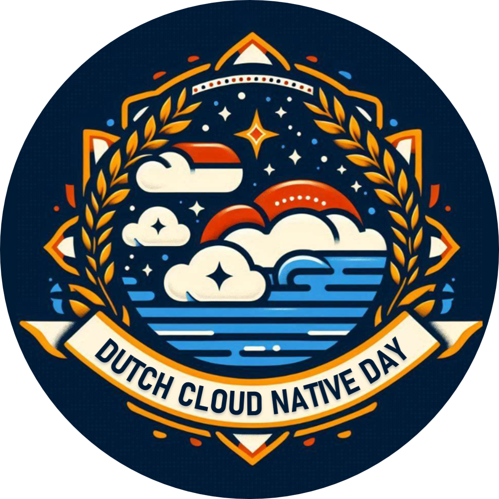

Dutch Cloud Native Day is a local (and International), community-organized event that gathers adopters and technologists from open source and cloud native communities.

This is the second edition of DCND in the Netherlands, aiming to bring the community together. The event provides a platform for professionals and experts from all levels and backgrounds to learn, network, and share their knowledge about cloud native technologies. 

The next DCND is on July 3 in Utrecht.
More info: [Dutch Cloud Native Day](http://dutchcloudnativeday.nl)
