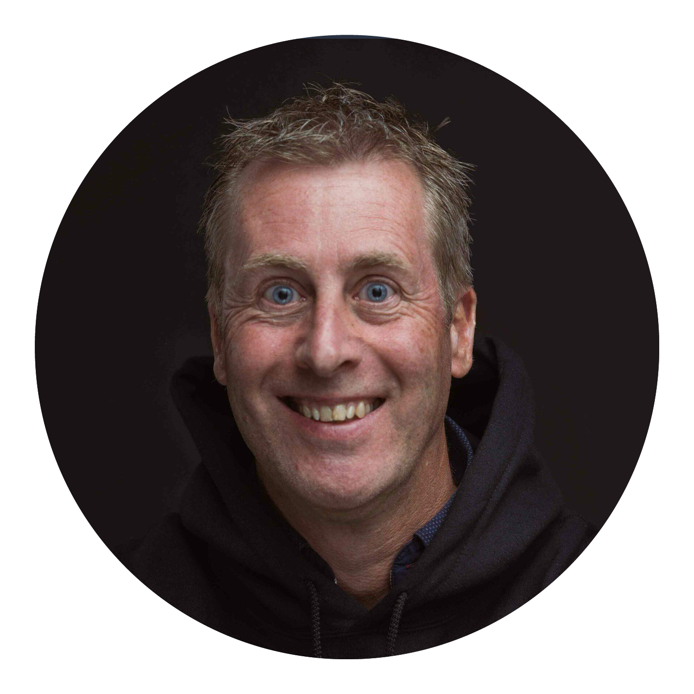

Leveraging 32 years of experience in IT and secondment, I have spent the last 8 years specializing in Kubernetes. As a part-time event manager, I merge my passion for technology with strong organizational skills, organizing meetups focused on containerization and related cloud native technologies to bridge the gap between technical expertise and community building. Since 2022, I have been a core organizer for my local community. My contributions also extend to the broader ecosystem, where I am actively involved with several Kubernetes Community Days (KCDs), Dutch Cloud Native Days, and the CNCF TAG for Environmental Sustainability. I am also the founder and board member of “Stichting Cloud Native Netherlands”, with promoting Open Source software and Cloud native technology in the Netherlands by organizing events and activities around these technologies. Sharing knowledge and building a strong community around the CNCF ecosystem is always a key motivator for me. And in 2025 I'm became a CNCF Ambassador and leveraging the power of that role. For the Stichting Cloud Native Netherlands I'm the Treasurer.
